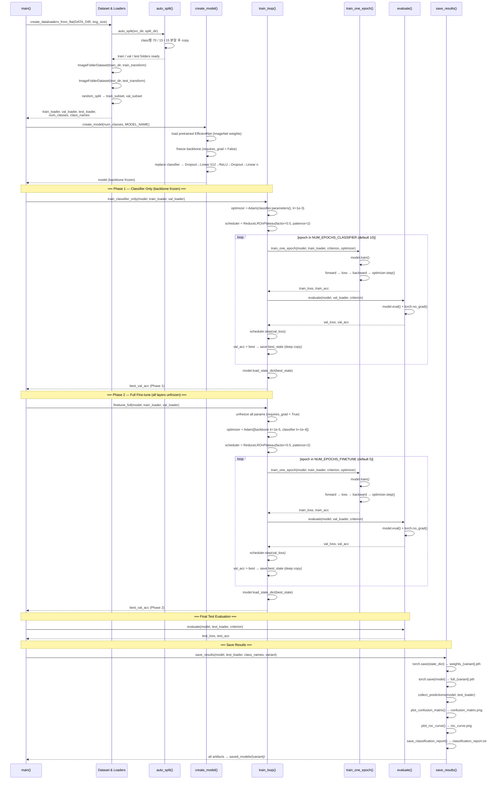

# EfficientNet Transfer Learning — Training Process Workflow

```mermaid
sequenceDiagram
    participant M  as main()
    participant DS as Dataset & Loaders
    participant SP as auto_split()
    participant MDL as create_model()
    participant TL as train_loop()
    participant TOE as train_one_epoch()
    participant EV as evaluate()
    participant SR as save_results()

    %% ── Data Preparation ──────────────────────────────────────
    M->>DS: create_dataloaders_from_flat(DATA_DIR, img_size)
    DS->>SP: auto_split(src_dir, split_dir)
    SP->>SP: class별 70 / 15 / 15 분할 후 copy
    SP-->>DS: train / val / test folders ready
    DS->>DS: ImageFolderDataset(train_dir, train_transform)
    DS->>DS: ImageFolderDataset(test_dir,  test_transform)
    DS->>DS: random_split → train_subset, val_subset
    DS-->>M: train_loader, val_loader, test_loader,<br/>num_classes, class_names

    %% ── Model Creation ────────────────────────────────────────
    M->>MDL: create_model(num_classes, MODEL_NAME)
    MDL->>MDL: load pretrained EfficientNet (ImageNet weights)
    MDL->>MDL: freeze backbone (requires_grad = False)
    MDL->>MDL: replace classifier → Dropout→Linear 512→ReLU→Dropout→Linear n
    MDL-->>M: model  (backbone frozen)

    %% ── Phase 1 ───────────────────────────────────────────────
    Note over M,TL: ══ Phase 1 — Classifier Only (backbone frozen) ══

    M->>TL: train_classifier_only(model, train_loader, val_loader)
    TL->>TL: optimizer = Adam(classifier.parameters(), lr=1e-3)
    TL->>TL: scheduler = ReduceLROnPlateau(factor=0.5, patience=2)

    loop epoch in NUM_EPOCHS_CLASSIFIER (default 10)
        TL->>TOE: train_one_epoch(model, train_loader, criterion, optimizer)
        TOE->>TOE: model.train()
        TOE->>TOE: forward → loss → backward → optimizer.step()
        TOE-->>TL: train_loss, train_acc

        TL->>EV: evaluate(model, val_loader, criterion)
        EV->>EV: model.eval() + torch.no_grad()
        EV-->>TL: val_loss, val_acc

        TL->>TL: scheduler.step(val_loss)
        TL->>TL: val_acc > best → save best_state (deep copy)
    end

    TL->>TL: model.load_state_dict(best_state)
    TL-->>M: best_val_acc (Phase 1)

    %% ── Phase 2 ───────────────────────────────────────────────
    Note over M,TL: ══ Phase 2 — Full Fine-tune (all layers unfrozen) ══

    M->>TL: finetune_full(model, train_loader, val_loader)
    TL->>TL: unfreeze all params (requires_grad = True)
    TL->>TL: optimizer = Adam([backbone lr=1e-5, classifier lr=1e-4])
    TL->>TL: scheduler = ReduceLROnPlateau(factor=0.5, patience=2)

    loop epoch in NUM_EPOCHS_FINETUNE (default 5)
        TL->>TOE: train_one_epoch(model, train_loader, criterion, optimizer)
        TOE->>TOE: model.train()
        TOE->>TOE: forward → loss → backward → optimizer.step()
        TOE-->>TL: train_loss, train_acc

        TL->>EV: evaluate(model, val_loader, criterion)
        EV->>EV: model.eval() + torch.no_grad()
        EV-->>TL: val_loss, val_acc

        TL->>TL: scheduler.step(val_loss)
        TL->>TL: val_acc > best → save best_state (deep copy)
    end

    TL->>TL: model.load_state_dict(best_state)
    TL-->>M: best_val_acc (Phase 2)

    %% ── Final Test Evaluation ─────────────────────────────────
    Note over M,EV: ══ Final Test Evaluation ══

    M->>EV: evaluate(model, test_loader, criterion)
    EV-->>M: test_loss, test_acc

    %% ── Save Results ──────────────────────────────────────────
    Note over M,SR: ══ Save Results ══

    M->>SR: save_results(model, test_loader, class_names, variant)
    SR->>SR: torch.save(state_dict) → weights_{variant}.pth
    SR->>SR: torch.save(model)      → full_{variant}.pth
    SR->>SR: collect_predictions(model, test_loader)
    SR->>SR: plot_confusion_matrix() → confusion_matrix.png
    SR->>SR: plot_roc_curve()        → roc_curve.png
    SR->>SR: save_classification_report() → classification_report.txt
    SR-->>M: all artifacts → saved_models/{variant}/
```
